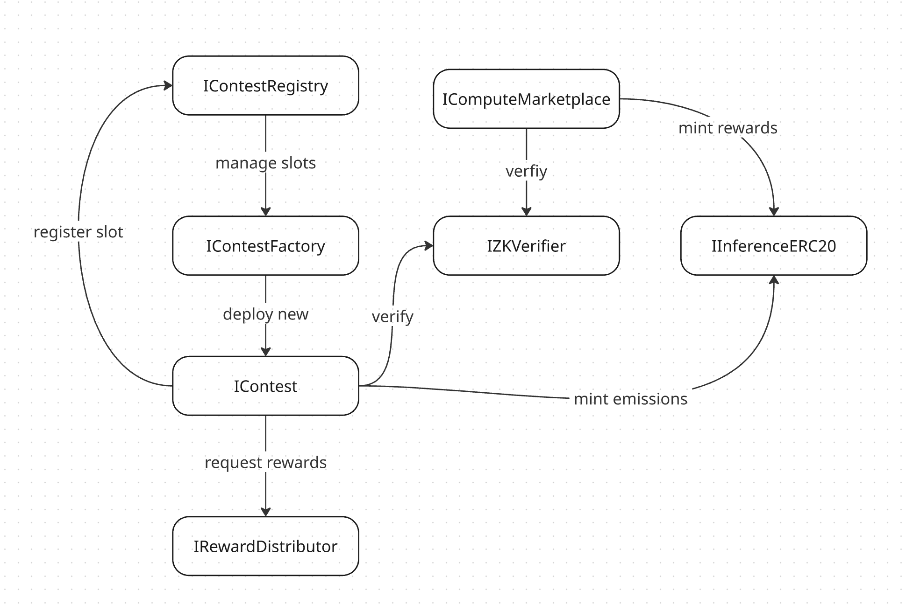

# Inference Protocol

A decentralized protocol for AI inference competitions and compute marketplace, built on Ethereum with zero-knowledge proof verification.

## Overview

The Inference Protocol is a comprehensive ecosystem that combines competitive AI inference contests with a decentralized compute marketplace. The protocol enables:

- **AI Inference Contests**: Competitive environments where participants submit AI model outputs
- **Compute Marketplace**: Decentralized marketplace for AI computation jobs
- **ZK Proof Verification**: Zero-knowledge proof verification for computation integrity
- **Token Economics**: Native token system for rewards and governance



## Architecture

### Core Components

#### 1. Contest System (`IContest.sol`)
The contest system manages competitive AI inference challenges with two types:

- **Temporary Contests**: Fixed-duration competitions
- **Everlasting Contests**: Continuous competitions with periodic epochs

**Key Features:**
- Participant management with staking requirements
- Epoch-based reward distribution
- Creator fee collection
- Performance ranking system

#### 2. Contest Factory (`IContestFactory.sol`)
Factory contract for creating new contests with configurable parameters.

**Configuration Options:**
- Creator fee percentage
- Contest duration (0 for everlasting)
- Participant limits
- Staking requirements

#### 3. Contest Registry (`IContestRegistry.sol`)
Manages contest slots and implements a Dutch auction system for slot replacement.

**Features:**
- Limited contest slots with performance-based ranking
- Dutch auction mechanism for slot replacement
- Performance scoring and threshold management

#### 4. Compute Marketplace (`IComputeMarketplace.sol`)
Decentralized marketplace for AI computation jobs with ZK proof verification.

**Job Lifecycle:**
1. **Posted**: Job created with bounty and specifications
2. **Claimed**: Provider takes on the job
3. **Completed**: Results submitted with ZK proof
4. **Verified**: Proof verification and payment

#### 5. ZK Verifier (`IZKVerifier.sol`)
Zero-knowledge proof verification system for computation integrity.

**Features:**
- EZKL proof verification
- Model registration and management
- Batch verification capabilities
- Gas cost estimation

#### 6. Reward Distributor (`IRewardDistributor.sol`)
Manages token emissions and reward distribution across the protocol.

**Distribution:**
- Compute marketplace rewards
- Contest rewards with weighted allocation
- Configurable emission rates and epochs

#### 7. Inference Token (`IInferenceERC20.sol`)
Native ERC20 token for the protocol with minting capabilities.

## Getting Started

### Prerequisites

- Foundry (latest version)
- Node.js (for development tools)
- Git

### Installation

1. **Clone the repository:**
   ```bash
   git clone https://github.com/Inference-xyz/protocol.git
   cd protocol
   ```

2. **Install dependencies:**
   ```bash
   forge install
   ```

3. **Build the project:**
   ```bash
   forge build
   ```

4. **Run tests:**
   ```bash
   forge test
   ```

## Contributing

**⚠️ Work in Progress**: This project is currently under active development. The protocol is not yet production-ready and may undergo significant changes.

We welcome contributions from the community! Whether you're interested in:
- Smart contract development and security
- Testing and documentation
- Protocol design and economics
- Frontend and integration work

Please see our [Contributing Guidelines](CONTRIBUTING.md) for detailed information on how to get started, our development workflow, and submission process.

### Quick Start for Contributors

1. Fork the repository
2. Create a feature branch (`git checkout -b feature/amazing-feature`)
3. Make your changes following our [code style guidelines](CONTRIBUTING.md#code-style-guidelines)
4. Add tests for new functionality
5. Ensure all tests pass (`forge test`)
6. Commit your changes (`git commit -m 'Add amazing feature'`)
7. Push to the branch (`git push origin feature/amazing-feature`)
8. Open a Pull Request

For questions or discussions, please open an issue or join our community channels.

## Security Features

### Zero-Knowledge Proofs

- **Computation Integrity**: ZK proofs verify computation correctness
- **Privacy**: Input data remains private
- **Gas Efficiency**: Optimized verification costs

### Contest Security

- **Staking Requirements**: Participants must stake tokens
- **Performance Ranking**: Merit-based slot allocation
- **Dutch Auction**: Fair slot replacement mechanism

### Marketplace Security

- **Timeout Mechanisms**: Automatic job cancellation
- **Dispute Resolution**: Multi-party dispute handling
- **Reputation System**: Provider quality scoring

## License

This project is licensed under the MIT License - see the [LICENSE](LICENSE) file for details.
