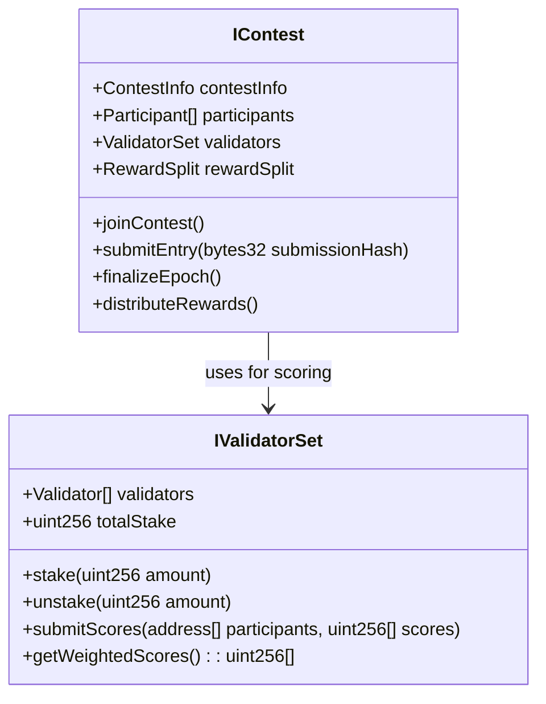
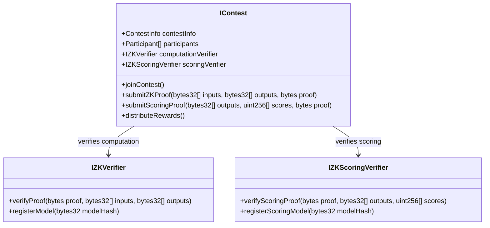

# Inference Protocol Architecture

## Overview

The Inference Protocol is a decentralized system for AI inference competitions with two distinct contest design variants.

## Core Components

### 1. Token System (`IInferenceERC20.sol`)
- Native ERC20 token for rewards and governance
- Minting capabilities for reward distribution

### 2. Reward Distributor (`IRewardDistributor.sol`)
- Manages token emissions across the protocol
- Tamper-proof reward distribution
- Math-based emission calculations

### 3. Contest System

#### Variant 1: Validator Set Only

**Key Features:**
- Stake-weighted validator selection
- Validators directly score submissions
- Consensus-based final scoring
- Slashing mechanism for malicious behavior
- Contest owner controls reward percentages

#### Variant 2: ZK Proof Only

**Key Features:**
- Participants prove computation (input → output)
- Single verifier proves scoring function execution
- Contest owner deploys scoring verifier contract
- Participants can deploy computation verifiers
- Tamper-proof reward distribution

### 4. Contest Factory (`IContestFactory.sol`)
- Creates contests with configurable parameters
- Supports both validator set and ZK proof variants

### 5. Contest Registry (`IContestRegistry.sol`)
- Manages contest slots with performance-based ranking
- Dutch auction mechanism for slot replacement

## Design Comparison

| Aspect | Validator Set | ZK Proof Only |
|--------|---------------|---------------|
| **Decentralization** | High (multiple validators) | Medium (single verifier) |
| **Gas Costs** | Low (no ZK verification) | High (ZK proof verification) |
| **Trust Model** | Trust in validator consensus | Trust in ZK proof system |
| **Scalability** | Limited by validator count | Limited by ZK proof costs |
| **Complexity** | Simple consensus mechanism | Complex ZK proof integration |

## Implementation Flow

### Validator Set Variant
1. Contest owner creates contest with validator parameters
2. Validators stake tokens to participate
3. Participants submit inference results
4. Validators independently score submissions
5. Stake-weighted consensus determines final scores
6. Rewards distributed based on consensus scores

### ZK Proof Variant
1. Contest owner deploys scoring verifier contract
2. Participants submit inference results with ZK proofs
3. Verifier runs scoring function and generates ZK proof
4. Smart contract verifies all proofs on-chain
5. Rewards automatically distributed based on verified scores
