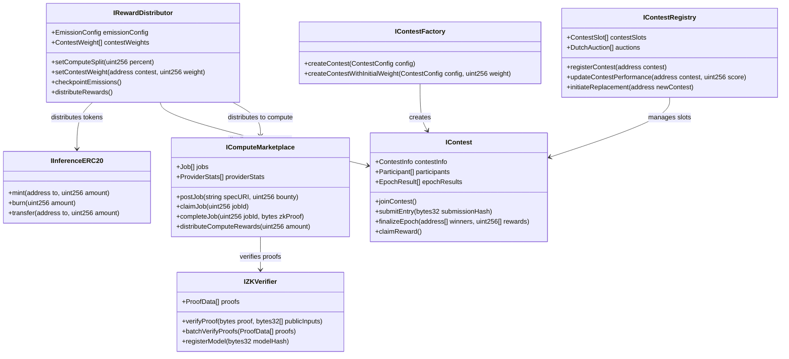
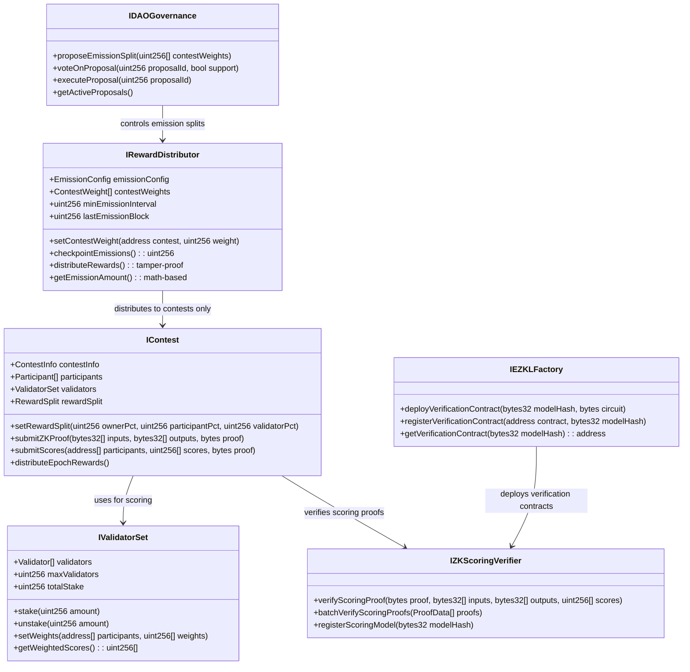
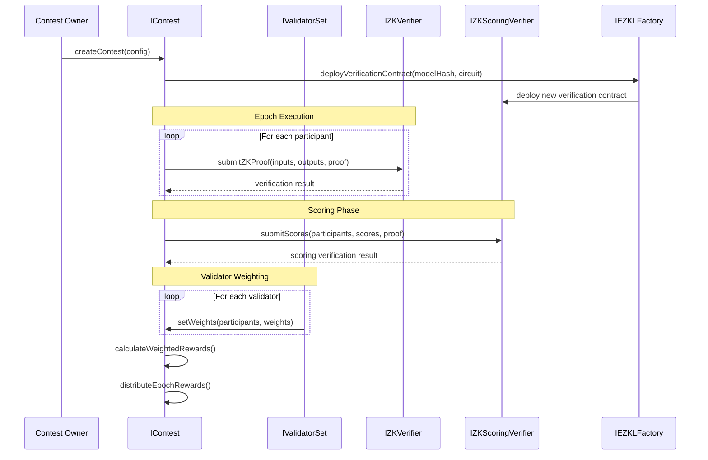

# Inference Protocol Architecture - Current vs Proposed

## Current Architecture Overview

## Proposed Architecture Changes

### 1. Updated Reward Distribution System

### 2. Enhanced Contest System with ZK Proofs

