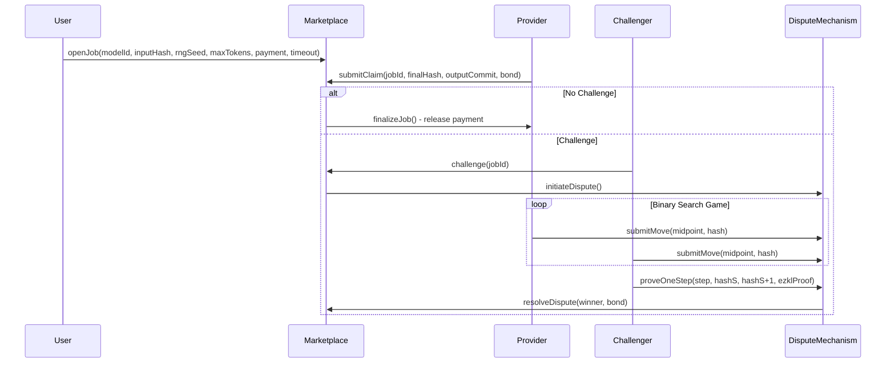
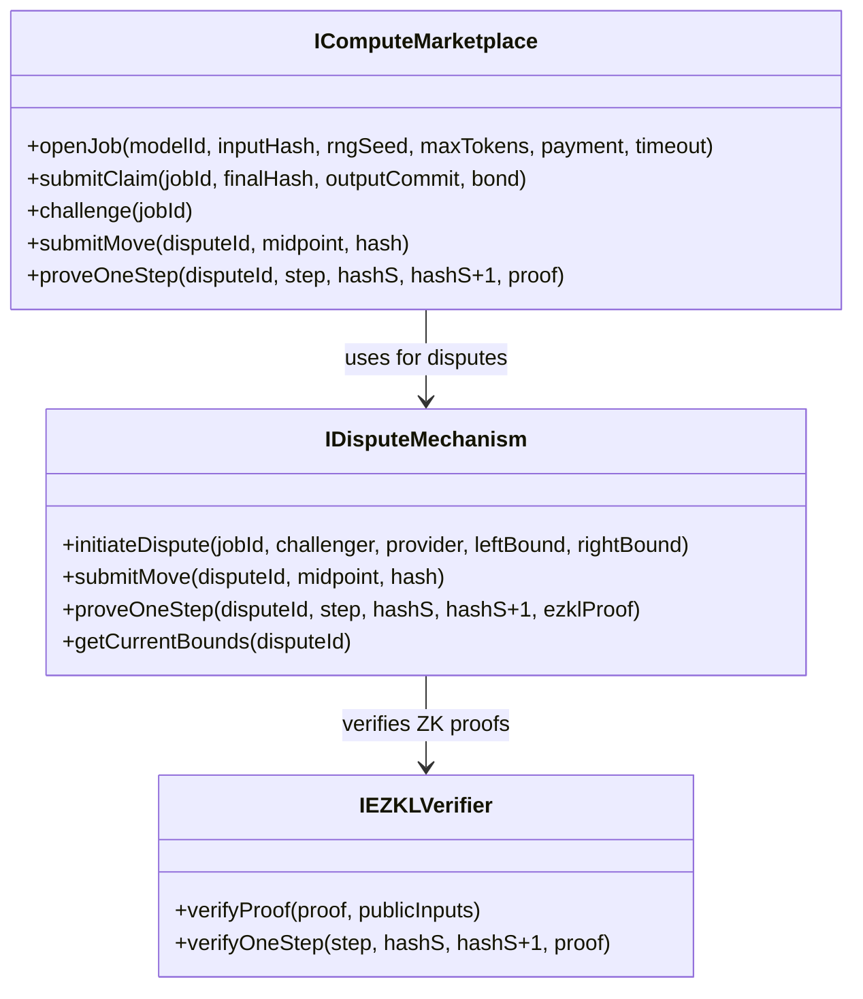
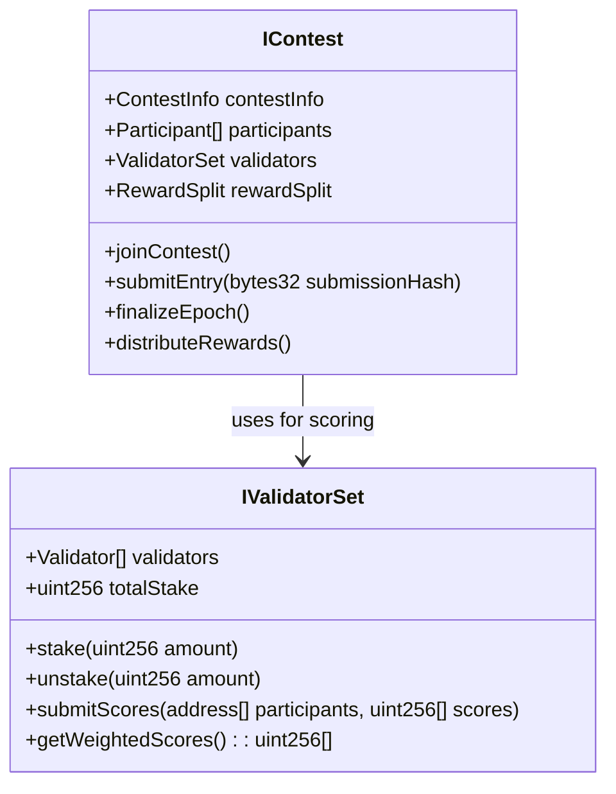
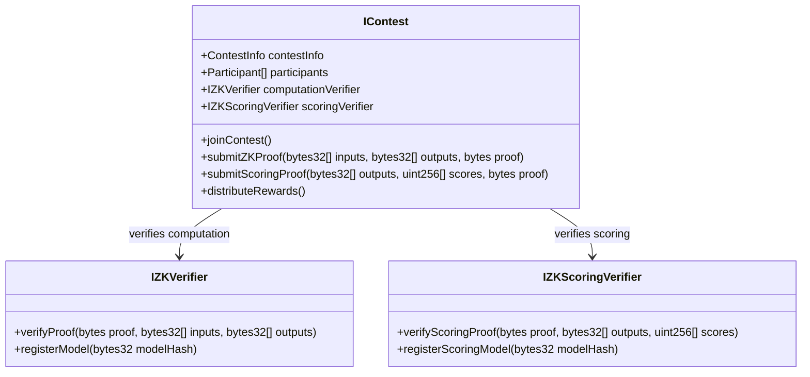
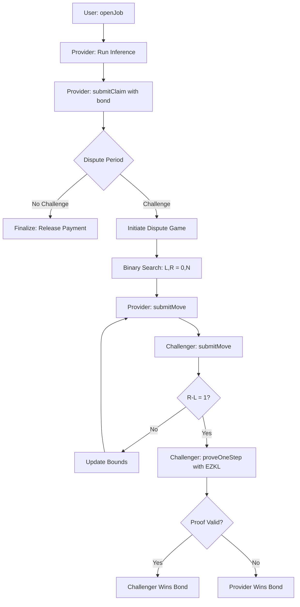

# Inference Protocol Architecture

## Overview

The Inference Protocol is a decentralized system for AI inference with an optimistic rollup design using EZKL ZK proofs for dispute resolution. The system enables trustless AI inference by allowing compute providers to optimistically execute jobs and only requiring ZK proofs when disputes arise.

## Core Components

### 1. Token System (`IInferenceERC20.sol`)
- Native ERC20 token for rewards and governance
- Minting capabilities for reward distribution

### 2. Reward Distributor (`IRewardDistributor.sol`)
- Manages token emissions across the protocol
- Tamper-proof reward distribution
- Math-based emission calculations

### 3. Optimistic Rollup Compute Marketplace

The core innovation is an optimistic rollup design for AI inference that combines the efficiency of optimistic execution with the security of ZK proofs for disputes.

#### Key Features:
- **Optimistic Execution**: Compute providers run inference immediately and post claims
- **Dispute Period**: Time window for challenges before finalization
- **Two-Way Verification Game**: Binary search to find disputed step
- **EZKL ZK Proofs**: Cryptographic proof of incorrect computation at specific step
- **Bond Mechanism**: Economic incentives for honest behavior

#### Workflow:

#### Interface Design:

### 4. Contest System

#### Variant 1: Validator Set Only

**Key Features:**
- Stake-weighted validator selection
- Validators directly score submissions
- Consensus-based final scoring
- Slashing mechanism for malicious behavior
- Contest owner controls reward percentages

#### Variant 2: ZK Proof Only

**Key Features:**
- Participants prove computation (input → output)
- Single verifier proves scoring function execution
- Contest owner deploys scoring verifier contract
- Participants can deploy computation verifiers
- Tamper-proof reward distribution

### 4. Contest Factory (`IContestFactory.sol`)
- Creates contests with configurable parameters
- Supports both validator set and ZK proof variants

### 5. Contest Registry (`IContestRegistry.sol`)
- Manages contest slots with performance-based ranking
- Dutch auction mechanism for slot replacement

## Design Comparison

| Aspect | Optimistic Rollup | Validator Set | ZK Proof Only |
|--------|------------------|---------------|---------------|
| **Decentralization** | High (anyone can challenge) | High (multiple validators) | Medium (single verifier) |
| **Gas Costs** | Low (only on disputes) | Low (no ZK verification) | High (ZK proof verification) |
| **Trust Model** | Trust in economic incentives | Trust in validator consensus | Trust in ZK proof system |
| **Scalability** | High (optimistic execution) | Limited by validator count | Limited by ZK proof costs |
| **Complexity** | Medium (dispute mechanism) | Simple consensus mechanism | Complex ZK proof integration |
| **Latency** | Fast (immediate results) | Medium (consensus time) | Slow (proof generation) |

## Implementation Flow

### Optimistic Rollup Variant
1. User posts inference job with model_id, input_hash, rng_seed, max_tokens, payment, timeout
2. Compute provider runs inference immediately and returns result
3. Provider submits claim with final_hash, output_commit, and bond
4. Dispute period begins - anyone can challenge the claim
5. If no challenge: funds released to provider after dispute period
6. If challenged: two-way verification game begins

#### Detailed Optimistic Rollup Flow:

### Validator Set Variant
1. Contest owner creates contest with validator parameters
2. Validators stake tokens to participate
3. Participants submit inference results
4. Validators independently score submissions
5. Stake-weighted consensus determines final scores
6. Rewards distributed based on consensus scores

### ZK Proof Variant
1. Contest owner deploys scoring verifier contract
2. Participants submit inference results with ZK proofs
3. Verifier runs scoring function and generates ZK proof
4. Smart contract verifies all proofs on-chain
5. Rewards automatically distributed based on verified scores
